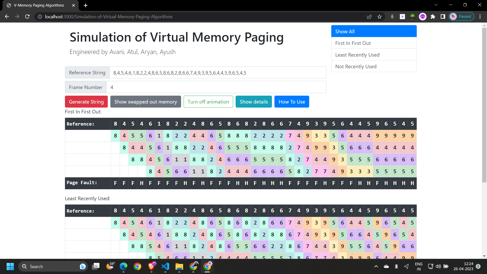

## Virtual Memory Management

This is an operating system assignment conducted in my university which serves the purpose of visualizing virtual memory paging algorithms including First in First Out, Least Recently Used. 

## Development Platform

- Node.js (Package management and back end developmemnt)
- React JS (Front end development)

## Screenshot

## Development Guide

Project is supported at port 3000.
Online deployed at [http://localhost:3000](http://localhost:3000).

## Developed by
1. Avani Jain   
2. Ayush Anand
3. Aryan Ashok Rajani
4. Atul Raj

